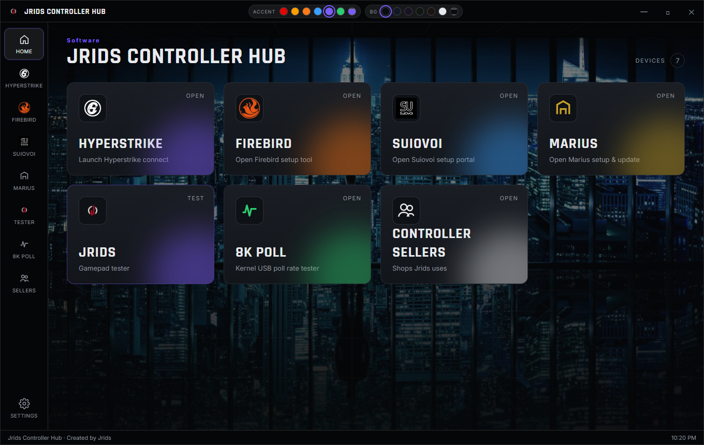
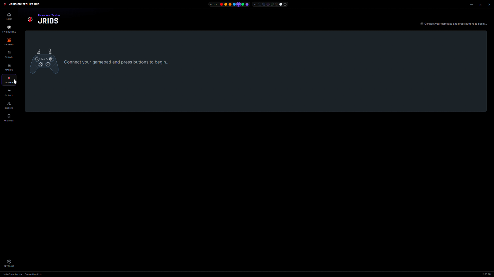
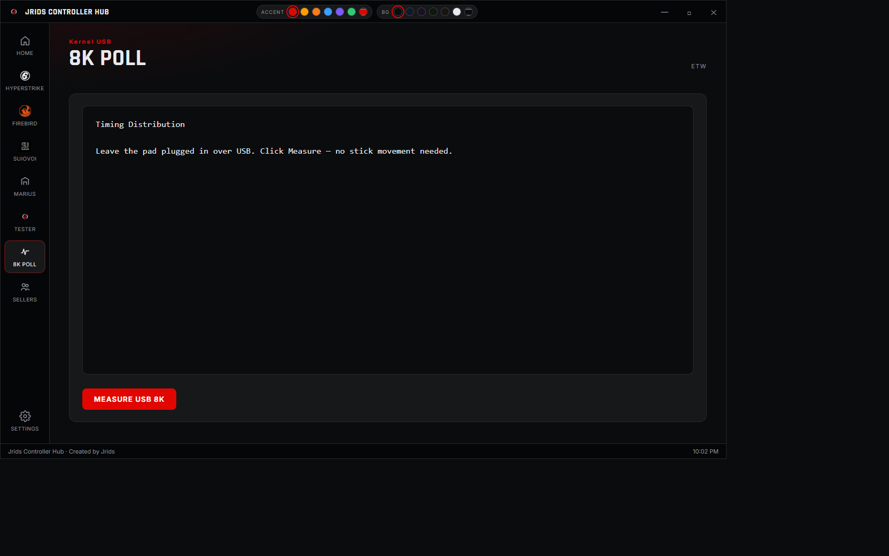
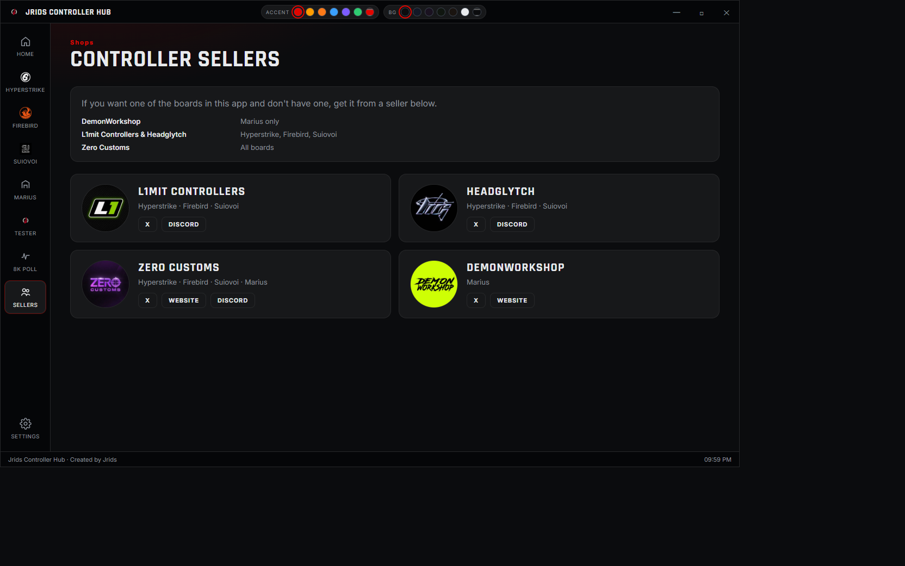
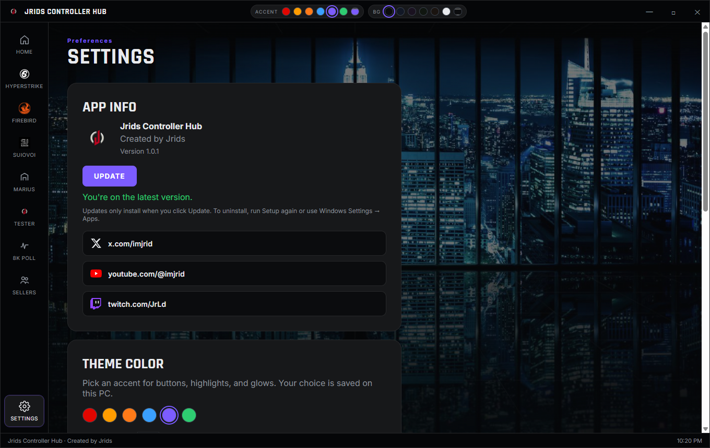
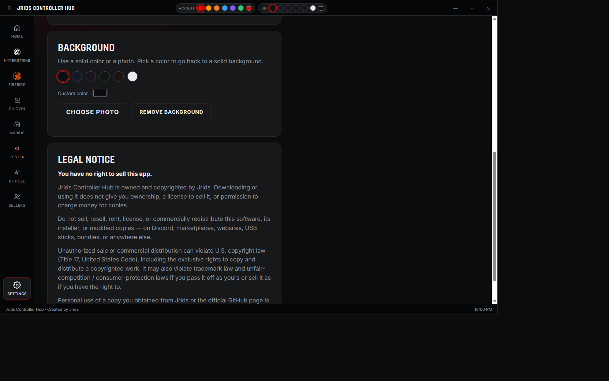

# Jrids Controller Hub

Windows launcher and gamepad tester created by [Jrids](https://x.com/imjrid).



## Screenshots

**Gamepad tester**



**8K Poll**



**Controller Sellers**



**Settings**



**Legal notice**



## Install

1. Download **JridsControllerHubSetup.exe** from [Releases](../../releases).
2. Run the installer.
3. Open **Jrids Controller Hub** from the Start menu.

In the app, open **Settings** and use **Check for updates**.

Windows 10/11 64-bit. If Windows shows **Windows protected your PC**, choose **More info** → **Run anyway** (the app is not code-signed yet).

You can also run `release/Jrids Controller Hub.exe` without installing.

## What it includes

- Hyperstrike, Firebird, Suiovoi, and Marius setup/update launchers
- Jrids gamepad tester
- Theme colors and app info

## Socials

- [X](https://x.com/imjrid)
- [YouTube](https://www.youtube.com/@imjrid)
- [Twitch](https://www.twitch.tv/JrLd)

## Build from source

Needs [Git](https://git-scm.com/), [.NET 10 SDK](https://dotnet.microsoft.com/download), and [Inno Setup](https://jrsoftware.org/isinfo.php) for the installer.

```bat
dotnet publish JridsControllerHub.csproj -c Release -o release
"C:\Program Files (x86)\Inno Setup 6\ISCC.exe" installer\JridsControllerHub.iss
```
